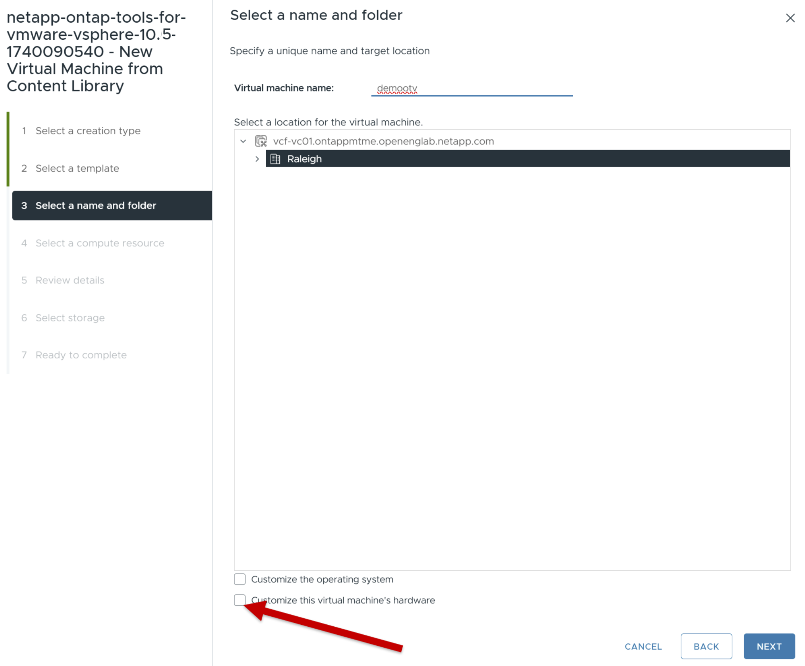
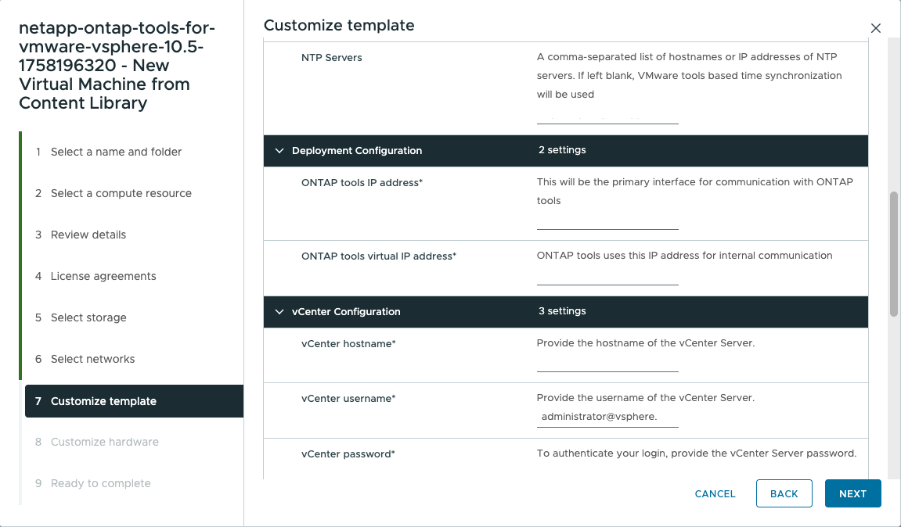
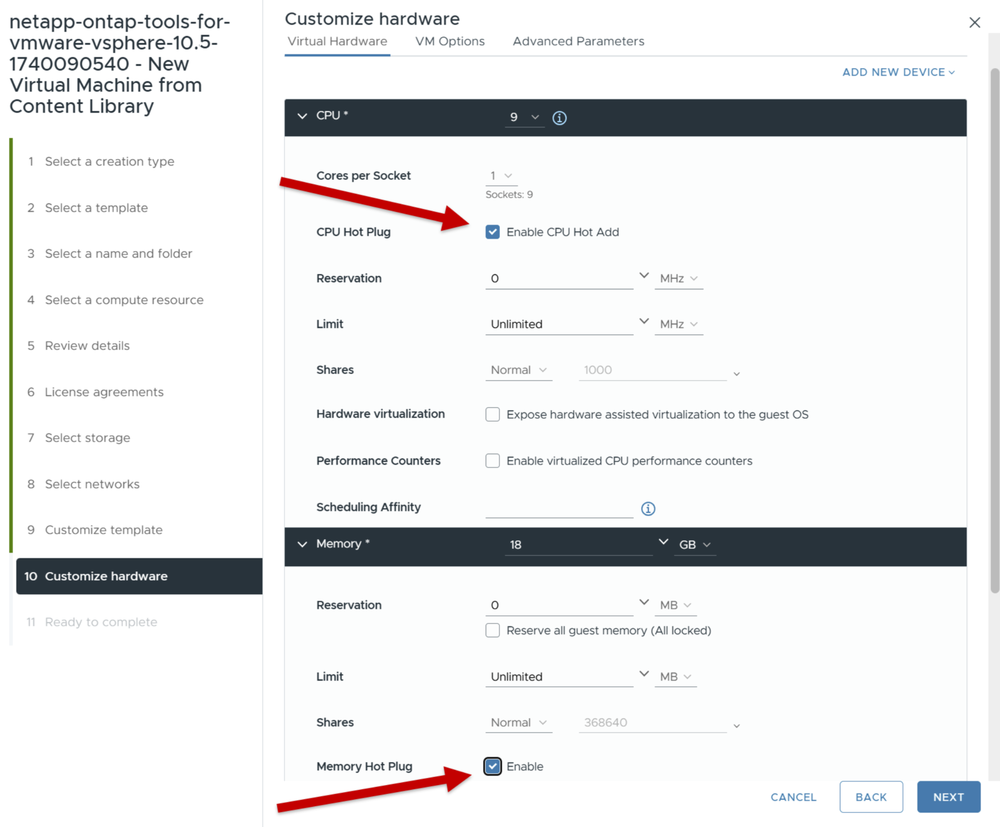

= 部署適用於 VMware vSphere 的 ONTAP 工具
:allow-uri-read: 
:icons: font
:imagesdir: ../media/

[role="lead"]
ONTAP tools for VMware vSphere部署為小型單節點，具有核心服務以支援 NFS 和 VMFS 資料儲存庫。ONTAP部署過程最多可能需要 45 分鐘。

.開始之前
如果您正在部署小型單節點，則內容庫是可選的。對於多節點或 HA 部署，需要內容庫。在 VMware 中，內容庫儲存 VM 範本、vApp 範本和其他文件。使用內容庫進行部署可提供無縫體驗，因為它不依賴網路連線。

在創建內容庫之前請考慮以下事項：

* 在共享資料儲存上建立內容庫，以便叢集中的所有主機都可以存取它。
* 在部署適用ONTAP tools for VMware vSphere之前設定內容庫。
* 確保在為 HA 配置設備之前建立內容庫。
+

NOTE: 部署後不要刪除內容庫中的 OVA 範本。

NOTE: 為了將來啟用 HA 部署，請避免直接在 ESXi 主機上部署ONTAP工具虛擬機器。相反，將其部署在 ESXi 主機叢集或資源池中。

請依照以下步驟建立內容庫：

. 從下載包含ONTAP tools for VMware vSphere的二進位檔案 (_.ova_) 和簽署憑證的文件 https://mysupport.netapp.com/site/products/all/details/otv10/downloads-tab["NetApp 支援網站"^] 。
. 登入 vSphere 用戶端
. 選取 vSphere 用戶端功能表，然後選取 * 內容庫 * 。
. 選取頁面右側的 * 建立 * 。
. 提供文件庫名稱並建立內容庫。
. 轉到您創建的內容庫。
. 選取頁面右側的 * 動作 * 、然後選取 * 匯入項目 * 並匯入 OVA 檔案。

NOTE: 如需詳細資訊、請參閱 https://blogs.vmware.com/vsphere/2020/01/creating-and-using-content-library.html["建立及使用內容庫"]部落格。

NOTE: 在繼續部署之前，請將清單上的叢集分散式資源調度程式 (DRS) 設定為「保守」。這可確保虛擬機器在安裝期間不會被遷移。

ONTAP tools for VMware vSphere最初部署為非 HA 設定。若要擴充至高可用性部署，您需要啟用 CPU 熱插拔和記憶體熱插拔。您可以在部署過程中執行此步驟，也可以在部署後編輯虛擬機器設定。

.步驟
. 從下載包含ONTAP tools for VMware vSphere的二進位檔案 (_.ova_) 和簽署憑證的文件 https://mysupport.netapp.com/site/products/all/details/otv10/downloads-tab["NetApp 支援網站"^] 。如果您已經將OVA匯入內容庫，則可以跳過此步驟，繼續下一步。
. 登入 vSphere 伺服器。
. 前往您打算部署 OVA 的資源池、叢集或主機。
+

NOTE: 切勿將適用於 VMware vSphere 虛擬機器的 ONTAP 工具儲存在其管理的 VVols 資料存放區上。

. 您可以從內容庫或本機系統部署 OVA 。
+
|===

| 從本機系統 | 從內容庫 

| a. 按一下滑鼠右鍵並選取 * 部署 OVF 範本 ...* 。 b. 從 URL 選擇 OVA 檔案或瀏覽至其位置，然後選取 * 下一步 * 。 | a. 移至內容庫並選取您要部署的文件庫項目。 b. 從此範本中選取 * 「動作」 * > * 「新增虛擬機器」 * 
|===
. 在 * 選擇名稱和資料夾 * 欄位中，輸入虛擬機器名稱並選擇其位置。
+
** 如果您使用的是 vCenter Server 8.0.3 版本，請選取選項 * 自訂此虛擬機器的硬體 * ，此選項將會啟動名為 * 自訂硬體 * 的額外步驟，然後再前往 * 準備完成 * 視窗。
** 如果您使用的是 vCenter Server 7.0.3 版本，請依照部署結束時的*下一步是什麼？ *部分中的步驟進行操作。

. 選取電腦資源，然後選取 * 下一步 * 。（可選）選中複選框以 * 自動啓動已部署的 VM* 。
. 檢閱範本的詳細資料，然後選取 * 下一步 * 。
. 閱讀並接受授權合約、然後選擇 * 下一步 * 。
. 選取組態和磁碟格式的儲存設備，然後選取 * 下一步 * 。
. 選取每個來源網路的目的地網路，然後選取 * 下一步 * 。
. 在「自訂範本」視窗中，填寫必填欄位。
+

NOTE: vCenter 主機名稱是部署ONTAP工具設備的 vCenter Server 執行個體的名稱。

+
如果您在雙 vCenter Server 拓樸中部署ONTAP工具（其中裝置託管在一個 vCenter 執行個體中並管理另一個執行個體），則可以為託管ONTAP工具的 vCenter 執行個體指派受限角色。您可以建立一個專用的 vCenter 使用者和角色，僅授予其部署 OVF 範本所需的權限。詳情請參閱職位列表中所列的角色。 https://review.docs.netapp.com/us-en/ontap-tools-vmware-vsphere-10_otv105-releasebranch/concepts/rbac-vcenter-use.html#vsphere-object-hierarchy["適用於 VMware vSphere 10 的 ONTAP 工具隨附的角色"]。

+
對於將由ONTAP工具管理的 vCenter 實例，請確保 vCenter 使用者帳戶具有管理員權限。

+
** 主機名稱必須包含字母（ A-Z ， a-z ），數字（ 0-9 ）和連字號（ - ）。若要設定雙堆疊，請指定對應至 IPv6 位址的主機名稱。
+

NOTE: 不支援 Pure IPv6 。同時包含 IPv6 和 IPv4 位址的 VLAN 支援混合模式。

** ONTAP 工具 IP 位址是與 ONTAP 工具通訊的主要介面。
** IPv4 是節點組態的 IP 位址元件，可用於在節點上啟用診斷 Shell 和 SSH 存取，以進行除錯和維護。

. 使用 vCenter Server 8.0.3 版本時，在「自訂硬體」視窗中，啟用「CPU 熱新增」和「記憶體熱插拔」選項，以啟用 HA 功能。
. 查看 * 準備完成 * 視窗中的詳細資料、選取 * 完成 * 。
+
在建立部署工作時、進度會顯示在 vSphere 工作列中。

. 如果未選取自動開啟 VM 的選項，請在完成工作後開啟 VM 電源。

您可以在 VM 的 Web 主控台中追蹤安裝進度。

如果 OVF 表格有差異，則會出現一個對話方塊提示採取糾正措施。使用標籤按鈕進行導航，進行必要的更改，然後選擇*確定*。您有三次機會來解決任何問題。如果三次嘗試後問題仍然存在，安裝過程將停止，建議在新的虛擬機器上重新嘗試安裝。

.接下來呢？
如果您的 VMware vSphere 部署有 ONTAP 工具與 vCenter Server 7.0.2 ，請在部署之後遵循這些步驟。

. 登入 vCenter 用戶端
. 關閉 ONTAP 工具節點。
. 前往*庫存*下的ONTAP tools for VMware vSphere並選擇*編輯設定*選項。
. 在 *CPU* 選項下，選中 *Enable CPU Hot add* （啓用 CPU 熱添加 * ）複選框
. 在 * 記憶體 * 選項下，勾選 * 記憶體熱插拔 * 的 * 啟用 * 核取方塊。

