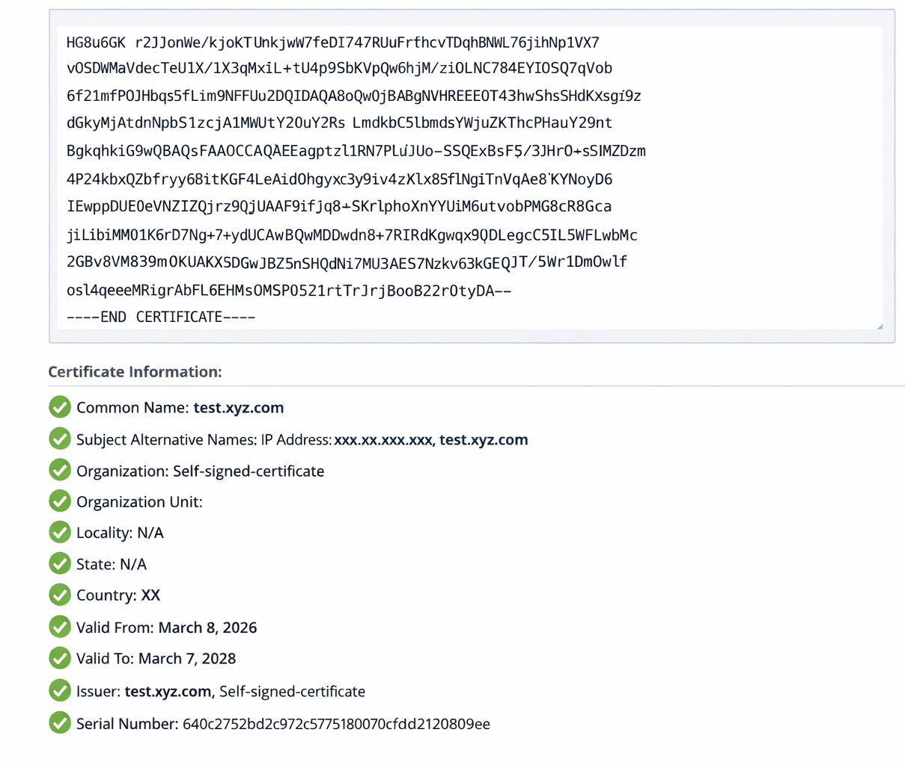

= 在 ONTAP tools 中變更憑證驗證標誌
:allow-uri-read: 
:icons: font
:imagesdir: ../media/

[role="lead"]
預設情況下，憑證驗證標誌是啟用的（設定為 true）。如果您需要繞過 SAN 憑證檢查，可以將ONTAP儲存後端憑證驗證標誌設定為 false。此設定不適用於 vCenter Server 憑證。

.開始之前
您必須擁有維護使用者登入認證。

.步驟
. 從 vCenter Server 開啟 ONTAP 工具的主控台。
. 以維護使用者身分登入。
. 進入 `1`選擇“應用程式配置”選單。
. 進入 `3`更改證書驗證標誌。
+
維護控制台顯示憑證驗證標誌狀態並提示您進行變更。

. 輸入“y”切換標誌或輸入“n”取消。

啟用憑證驗證標誌（設定為 true）後， ONTAP工具會檢查所有儲存後端是否使用具有主題備用名稱 (SAN) 的憑證。如果任何後端使用沒有 SAN 的證書，則無法啟用證書驗證。啟用此標誌之前，請確認所有儲存後端均使用基於 SAN 的憑證。如果停用憑證驗證標誌（設定為 false）， ONTAP工具將繞過所有已設定儲存後端的憑證驗證。

== 驗證儲存後端的 SAN 型憑證

為確保通訊安全和正確驗證，請確認所有儲存後端均使用基於 SAN 的憑證：

. 檢查 ONTAP 管理憑證是否包含主體別名 (SAN) 項目。
. 確認 SAN 條目與 ONTAP 管理 IP 位址或 DNS 名稱（或兩者）相符。
. 確保用於上線 ONTAP 的詳細資料與憑證的 SAN 項目中的 IP 位址或 DNS 名稱相符。

遵循這些步驟有助於防止憑證驗證問題，並確保 ONTAP 系統安全整合。

以下範例憑證顯示解碼資訊：

