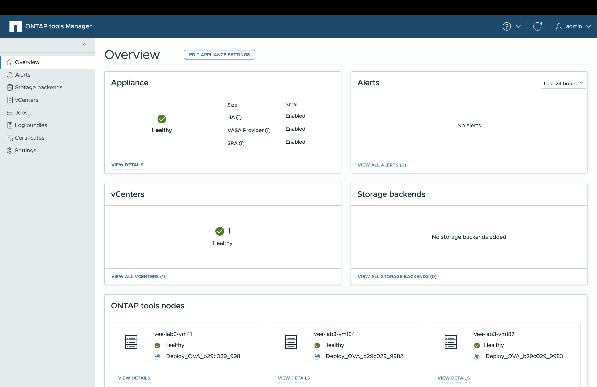

= 了解 ONTAP tools Manager 使用者介面
:allow-uri-read: 
:icons: font
:imagesdir: ../media/

[role="lead"]
ONTAP tools for VMware vSphere支援多租用戶，可管理多個 vCenter Server 執行個體。

ONTAP工具管理器是一個基於 Web 的控制台，用於管理ONTAP tools for VMware vSphere。

ONTAP工具管理器提供以下功能：

* 管理警報 - 檢視和過濾由ONTAP tools for VMware vSphere產生的警報。
* 管理儲存後端 - 新增和管理ONTAP儲存集群，並將其全域對應到 vCenter Server 執行個體。
* 管理 vCenter Server 執行個體 - 在ONTAP工具中新增和管理 vCenter Server 執行個體。
* 監控作業 - 監控和偵錯從ONTAP工具插件介面和ONTAP工具管理器介面啟動的非同步作業。您可以按時間段過濾作業、調整頁面大小並查看作業詳細信息，包括錯誤和子任務。按一下失敗狀態以查看錯誤詳細資訊。對於具有子任務的作業，展開行以查看描述和狀態。對於子作業，使用作業的下鑽來查看詳細資訊。
* 下載日誌包 - 收集日誌檔案以排除ONTAP tools for VMware vSphere故障。
* 管理證書 - 以自訂 CA 證書取代自簽名證書，並續訂或重新整理 VASA Provider 和ONTAP工具的證書。
* 重設密碼 - 變更 VASA 提供者和 SRA 的密碼。
* 管理設備設定 - 設定ONTAP工具設備，包括啟用 HA 和擴大節點大小。

若要存取 ONTAP 工具管理員、請 `\https://<ONTAPtoolsIP>:8443/virtualization/ui/`從瀏覽器啟動、然後使用您在部署期間提供的 VMware vSphere 管理員認證的 ONTAP 工具登入。

|===
| * 卡片 * | *說明* 

| 應用裝置卡 | 設備卡顯示ONTAP工具設備的整體狀態、設定詳細資訊以及已啟用服務的狀態。要查看更多信息，請選擇“查看詳細信息”鏈接。如果您更改設備設置，卡片將顯示作業狀態和詳細信息，直到更改完成。 

| 警示卡 | 警報卡顯示按類型分類的ONTAP工具警報，包括 HA 節點級警報。您可以透過點擊計數超連結來查看詳細警報，該超連結將帶您進入按所選警報類型過濾的警報頁面。 

| vCenters 卡 | vCenters 卡顯示由ONTAP工具管理的所有 vCenter Server 執行個體的健康狀況。您可以透過選擇相應的連結來查看每個 vCenter 的詳細信息，該連結將導航到包含有關所選實例的更多資訊的頁面。 

| 儲存後端卡 | 儲存後端卡顯示ONTAP工具中配置的所有ONTAP儲存叢集的健康和連線狀態。您可以透過選擇相應的連結來查看每個儲存後端的詳細信息，該連結將導航到包含有關所選集群的更多資訊的頁面。 

| ONTAP 工具節點卡 | ONTAP工具節點卡顯示設備中的所有節點，包括節點名稱、虛擬機器名稱、狀態和網路資訊。選擇“查看詳細資訊”以查看特定節點的更多詳細資訊。 [注意] 在非 HA 配置中，僅出現一個節點。在 HA 配置中，顯示三個節點。 
|===