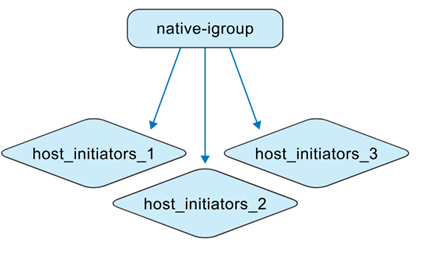
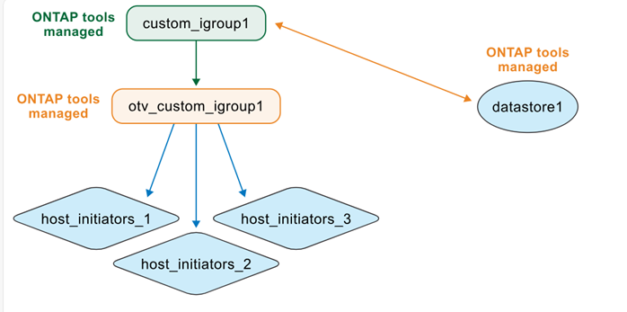

= ONTAP tools 如何管理 igroups
:allow-uri-read: 
:icons: font
:imagesdir: ../media/

[role="lead"]
如果您同時管理 ONTAP tools 虛擬機器和 ONTAP 儲存設備系統，則需要了解 igroup 的行為，尤其是在將資料儲存體從非 ONTAP tools 管理的環境移轉到 ONTAP tools 代管的環境時。ONTAP tools for VMware vSphere 使用巢狀 igroup 模型來表示和管理 igroup，了解此模型有助於您理解早期版本與目前實作之間的行為差異。

從 ONTAP tools for VMware vSphere 10.4 開始，ONTAP tools 會自動建立和維護 ONTAP 和 vCenter 物件，從而簡化 VMware 資料中心環境中的資料存放區管理。從 ONTAP tools for VMware vSphere 10.5 P2 開始，遷移後的 igroup 在不再使用時也會自動刪除。

[[quick-behavior-summary]]
== 快速行為摘要

* ONTAP tools 管理的 VMFS 資料儲存區使用巢狀 igroup：每個資料儲存區內容一個父 igroup，每個主機一個子 igroup。
* LUN 對應會套用至子 igroup。
* 自訂父級 igroup 可以在不同的資料存放區中重複使用。
* 從 ONTAP tools 9.x 移轉的 igroup 無法重複使用。

[[igroup-contexts]]
== Igroup 上下文

ONTAP tools for VMware vSphere 在兩種情況下處理 igroup。

.非ONTAP工具管理的 igroup
作為儲存管理員，您可以在 ONTAP 系統中建立扁平或嵌套結構的 igroup。下圖顯示了一個直接在 ONTAP 中建立的扁平 igroup。

.ONTAP工具管理的 igroup
建立資料存放區時，ONTAP tools for VMware vSphere 會以巢狀結構建立 igroup。

例如，如果您建立 datastore1 並將其裝載到主機 1、2 和 3 上，然後建立 datastore2 並將其裝載到主機 3、4 和 5 上，ONTAP tools 將重複使用主機層級 igroup 以進行有效管理。

image:../media/otv-managed.png["ONTAP工具管理的 igroup"]

image:../media/otv-managed2.png["ONTAP工具管理的 igroup 具有重複使用的子 igroup"]

[[naming-behavior]]
== 命名行為

建立資料存放區時，如果將 igroup 欄位留空，ONTAP tools 會建立預設的巢狀 igroup 結構。

* 父級 igroup 命名模式： `otv_<vcguid>_<host_parent_datacenterMoref>_<datastore_name>`
* 子 igroup 命名模式： `otv_<hostMoref>_<vcguid>`

ONTAP 系統介面在「父級發起者群組」欄位中顯示父級和子級 igroup 之間的關係。

[[behavior-by-scenario]]
== 依情境的行為

[cols="25,25,25,25"]
|===
| 情境 | 父系 igroup 行為 | 子 igroup 行為 | LUN 對應與可見度 

| 使用預設 igroup 設定建立的資料存放區 | 建立一個預設的 ONTAP tools 管理的父 igroup。 | 根據需要建立主機層級的子 igroup。 | LUN 對應到子 igroup。資料儲存區出現在 vCenter Server 清單中。 

| 使用自訂 igroup 名稱建立的資料存放區 | 使用指定的名稱建立自訂父級 igroup。 | 當主機重疊時，會重複使用現有的主機層級子 igroup。 | 新的資料儲存區 LUN 對應到重複使用或新建立的子 igroup。資料儲存區會顯示在 vCenter Server 中。 

| 在資料存放區建立期間重複使用現有的自訂 igroup | 選擇並重複使用現有的自訂父 igroup。 | 子 igroup 會根據主機成員資格重複使用或擴充。 | 新的資料儲存區 LUN 透過關聯的子 igroup 進行對應。資料儲存區會顯示在 vCenter Server 中。 

| 在 ONTAP 和 vCenter 中原生建立資料存放區和 igroup，然後由 ONTAP tools 探索 | ONTAP tools 在其管理內容中建立父 igroup，並保留原始 igroup 名稱。 | ONTAP tools 將原始 igroup 重新命名為  `otv_` 前綴，並將其表示為層次結構中的子 igroup。 | 啟動器映射保持不變。在探索期間，僅轉換映射至資料存放區的 igroup。 
|===

[[custom-igroup-reuse-and-api-behavior]]
== 自訂 igroup 重複使用和 API 行為

在 ONTAP tools 使用者介面中，建立資料存放區時，您可以從下拉式清單中重複使用現有的自訂父級 igroup。

API 也支援相同的行為。若要在建立資料儲存區時重複使用現有的 igroup，請在 API 請求承載中提供 igroup UUID。

NOTE: 只有自訂的 igroup 才能重複使用。從 ONTAP tools 9.x 移轉過來的 igroup 無法重複使用，並且從 ONTAP tools 10.5 P2 開始，不再使用的 igroup 將自動刪除。

[[native-to-managed-conversion-view]]
== 原生到託管的轉換檢視

如果直接在 ONTAP 系統和 VMware 環境中建立 igroup 和資料存放區，ONTAP tools 最初不會管理這些物件，從而導致 igroup 結構扁平。

image:../media/vmfsds-native.png["本地建立的資料儲存區和 igroup"]

資料儲存發現後，ONTAP tools 會識別並註冊對應到資料儲存的 igroup，然後將其表示為巢狀模型。父 igroup 表示在資料儲存級別，現有 igroup 會新增  `otv_` 前綴重命名為子 igroup，而發起程式對應保持不變。

ONTAP tools for VMware vSphere 無法偵測或管理在 ONTAP 系統中建立但未對應到資料儲存區或未連結到 ONTAP tools 的 igroup。在探索過程中，ONTAP tools 僅轉換已對應至已探索資料儲存區的 igroup；其他 igroup 仍保持未管理狀態。

[[reuse-of-discovered-native-igroups]]
== 重複使用已發現的原生 igroup

ONTAP tools 管理已發現的原生 igroup 後，該 igroup 將在資料儲存區建立的自訂啟動器群組名稱下拉式清單中可用。

新的資料儲存區 LUN 對應到規範化的子 igroup ，例如  `otv_NativeIgroup1` 。

ONTAP tools for VMware vSphere 無法偵測或使用在 ONTAP 系統中建立的、未由 ONTAP tools 管理或未連結到資料儲存區的 igroup。
