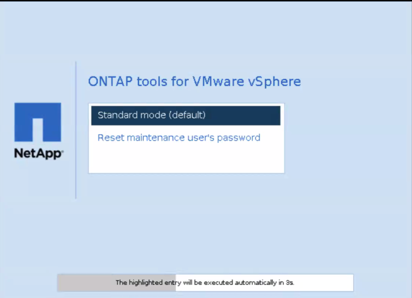

= 重設 ONTAP tools 維護主控台密碼
:allow-uri-read: 
:icons: font
:imagesdir: ../media/

[role="lead"]
在客戶作業系統重新啟動期間，GRUB 選單會顯示一個重設維護控制台使用者密碼的選項。使用此選項可以更新 VM 上的維護控制台使用者密碼。重設密碼後，VM 將重新啟動以套用新密碼。在 HA 部署中，VM 重新啟動後，系統會自動更新其他兩台 VM 上的密碼。

NOTE: 對於 ONTAP tools for VMware vSphere HA 部署，請變更 ONTAP tools 管理節點 （node1） 上的維護主控台使用者密碼。

.步驟
. 登入 vCenter Server
. 在 VM 上按一下滑鼠右鍵，然後選取 *Power* > *Restart Guest OS*。系統重新啟動期間，會出現下列畫面：
+
您有五秒鐘時間選擇選項。按任意鍵停止操作並凍結 GRUB 選單。

. 選取 * 重設維護使用者的密碼 * 選項。維護主控台隨即開啟。
. 在控制台中輸入並確認新密碼。你有三次機會。成功輸入新密碼後，系統將重新啟動。
. 按*回車鍵*繼續。系統更新虛擬機器上的密碼。

NOTE: 啟動虛擬機器時會顯示相同的 GRUB 選單。但是，重設密碼選項只能與 *Restart Guest OS* 選項一起使用。
