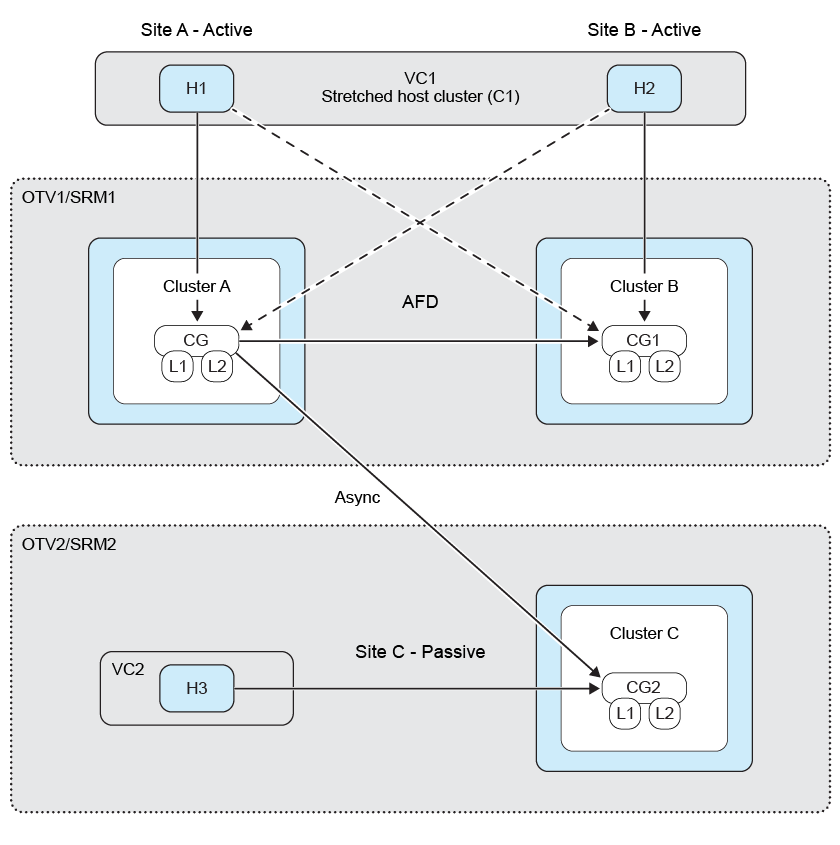
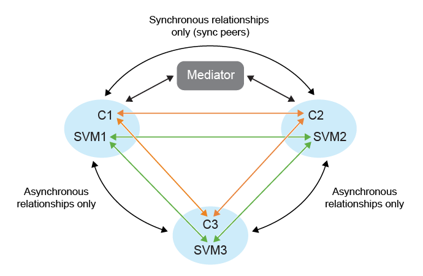

= ONTAP 工具中的扇出保護
:allow-uri-read: 
:icons: font
:imagesdir: ../media/

[role="lead"]
在扇出保護場景中，一致性群組受到雙重保護，在第一個目標ONTAP叢集上具有同步關係，在第二個目標ONTAP叢集上具有非同步關係。建立、編輯和刪除SnapMirror主動同步保護工作流程維護同步保護。  VMware Live Site Recovery 設備故障轉移和重新保護工作流程維持非同步保護。

NOTE: SVM 使用者不支援扇出功能。

若要設定扇出保護，請將三個站點叢集和 SVM 對等連接。

範例：

|===

| 如果 | 然後 

 a| 
* 來源一致性群組位於叢集 C1 和 SVM svm1 上
* 第一個目的地一致性群組位於叢集 C2 和 SVM svm2 和上
* 第二個目的地一致性群組位於叢集 C3 和 SVM svm3 上

 a| 
* 來源 ONTAP 叢集上的叢集對等關係將為（ C1 ， C2 ）和（ C1 ， C3 ）。
* 第一個目的地 ONTAP 叢集上的叢集對等關係將為（ C2 ， C1 ）和（ C2 ， C3 ）和
* 第二個目的地 ONTAP 叢集上的叢集對等關係將為（ C3 ， C1 ）和（ C3 ， C2 ）。
* SVM 在來源 SVM 上的對等關係將為（ svm1 ， svm2 ）和（ svm1 ， svm3 ）。
* 在第一個目的地 SVM 上執行 SVM 對等對等處理時，將會是（ svm2 ， svm1 ）和（ svm2 ， svm3 ）和
* 在第二個目的地 SVM 上執行 SVM 對等對等項將為（ svm3 ， svm1 ）和（ svm3 ， svm2 ）。

|===
下圖顯示了扇出保護配置： 

.步驟
. 選取新的預留位置資料存放區。分階段保護的預留位置資料存放區選取條件如下：
+
** 請勿將佔位資料儲存放置在您正在保護的主機叢集中。
** 如果需要將佔位資料儲存區包含在主機叢集中，請在設定 SnapMirror 主動式同步保護之前將其新增至 VMware Live Site Recovery 應用裝置。透過此設定，您可以將佔位資料儲存區排除在保護範圍之外。
+
有關詳細信息，請參閱 https://techdocs.broadcom.com/us/en/vmware-cis/live-recovery/site-recovery-manager/8-8/site-recovery-manager-administration-8-8/about-placeholder-virtual-machines/configure-a-placeholder-datastore.html["選取預留位置資料存放區"]

. 請依照 link:../manage/edit-hostcluster-protection.html["修改受保護的主機叢集"] 將資料存放區新增至主機叢集保護。新增非同步和同步原則類型。

